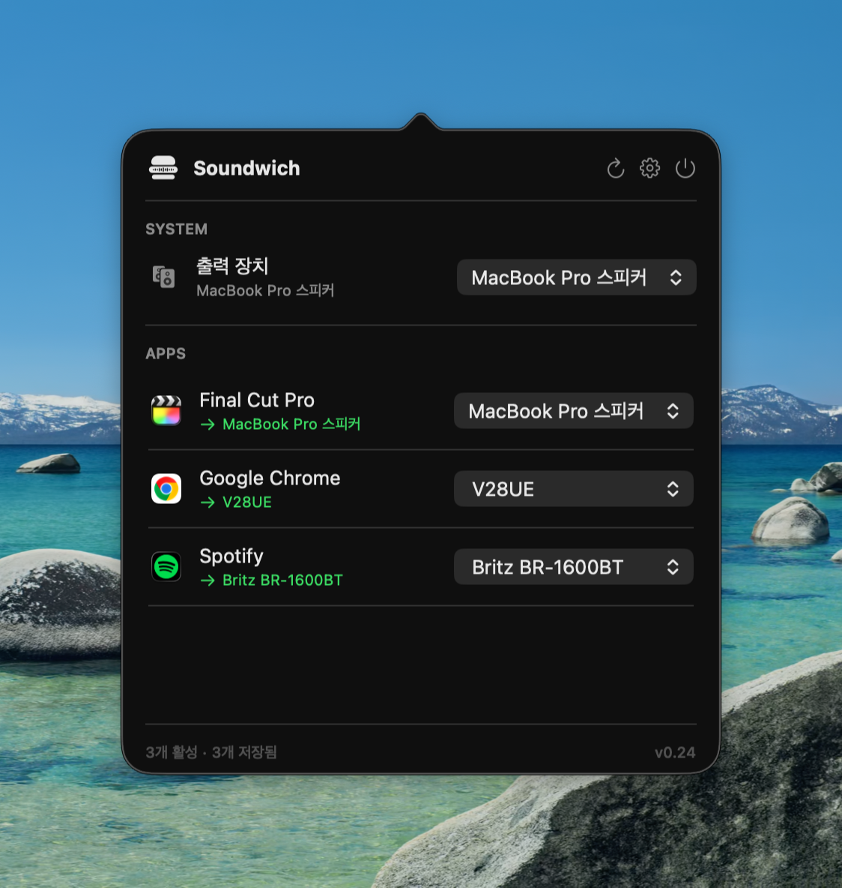

# Soundwich 🥪

**Per-app audio routing for macOS.** Send Spotify to your Bluetooth speaker, keep
your video call on your AirPods, and let everything else play through the MacBook
speakers — all at the same time.

> _A sandwich of sound — each app's audio goes where it belongs._

English · [한국어](README.ko.md)



## What it does

macOS only lets you pick **one** output device for the whole system. Soundwich
breaks that limit: it routes each app's audio to the device *you* choose, using
Apple's modern **CoreAudio Process Tap API** (macOS 14.2+) — no virtual audio
drivers to install.

- 🎯 **Per-app routing** — pick an output device for each app independently
- 🔀 **Multiple at once** — Spotify → speaker, Chrome → headphones, all live
- 🖥️ **System output switcher** — change the default device without opening Settings
- 💾 **Remembers your choices** — saved per app, restored on relaunch
- ✋ **Fully manual** — never switches on its own; you're always in control
- 🎧 **Handles hot-swaps** — unplug AirPods and audio falls back gracefully; plug
  them back in and the route restores automatically
- 🚀 **Launch at login** — optional, set it and forget it

## Install

1. Download the latest **`Soundwich.dmg`** from
   [Releases](https://github.com/zzanggi-haki/soundwich/releases).
2. Open it and drag **Soundwich** into **Applications**.
3. It's a free, unsigned build, so macOS Gatekeeper needs a one-time bypass —
   see **[INSTALL.md](INSTALL.md)** (the quick way is one Terminal command).
4. On first use, allow the **system audio recording** permission. That's how
   Soundwich captures an app's audio to re-route it.

**Requirements:** macOS 14.2 or later · Apple Silicon or Intel (universal build).

## How to use

1. Click the 🥪 icon in the menu bar.
2. Under **Apps**, find the app you want to redirect (it appears once it's playing
   audio).
3. Click its device dropdown and choose where its sound should go.
4. Done — that app now plays through the chosen device. Repeat for as many apps as
   you like.

To stop routing an app, open its dropdown and choose **제어 해제 / Stop controlling**.
Use the **System** section at the top to change the default output for everything else.

## Build from source

```sh
brew install xcodegen        # one time
xcodegen generate            # generates Soundwich.xcodeproj
open Soundwich.xcodeproj      # then ⌘R
```

To produce a distributable universal `.dmg`:

```sh
./scripts/build_dmg.sh       # → Soundwich.dmg (arm64 + x86_64)
```

## How it works

Soundwich creates a **Process Tap** on the target app, wraps it in a private
**aggregate audio device** whose output is your chosen device, and copies the
tapped audio through in a realtime IO callback. Routing is keyed by app bundle ID
and taps all of the app's processes at once — which is what makes browser audio
(played by helper processes) work reliably.

## License

[MIT](LICENSE)
